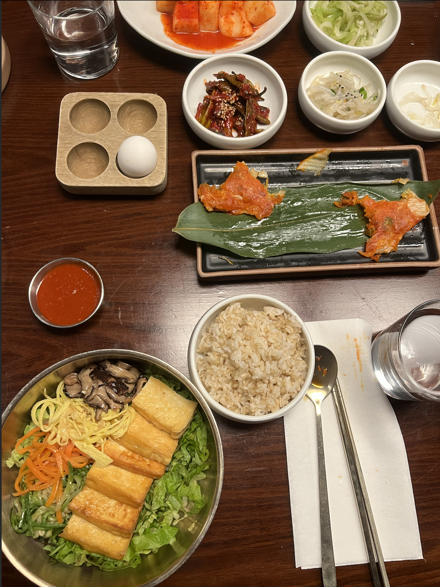
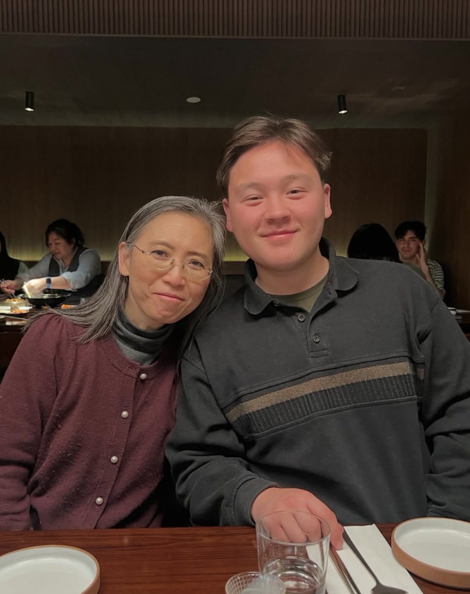

# DubuHaus

When visiting my brother in New York City, I was fortunate enough to visit the lovely, DubuHaus in Koreatown, Midtown Manhattan. This restaurant specializes in traditional and contemporary Korean dishes. They are especially know for their in house Dubu, made with organic, non-GMO soybeans daily.

## Restaurant and Meal

The restaurant was beautifully furnished with modern wooden pieces, simple and sleek dining ware, and back lit lighting for a perfect dining experience.

During my visit, I enjoyed a sample of their fresh soy milk, delicious array of banchan, Korean Pancakes Platter (kimchi mushroom, leek, and zucchini with mungbean), and for my entree the Dubu Vegetable Bibimbap. The meal culminated in a delicious vanilla bean soft serve.

## Images
:::: {layout-nrow=1}
{group="DubuHaus" .lightbox width="70%" fig-align="center"}

{group="DubuHaus" .lightbox width="70%" fig-align="center"}
::::
## Overall Review

I would rate DubuHaus 5 stars! The selection of appetizers and entrees captured the love of Korean cuisine and with each bite you could tell care and effort was put into your food. 

The waiters were exceptionally generous with banchan which is something I would never say no to! 

If you are every in New York City, I definitely recommend adding this stop to your list.

  ★★★★★

