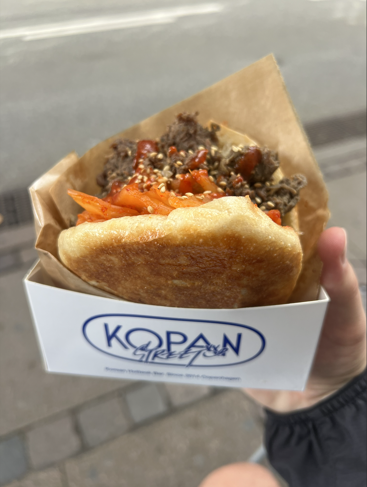

# Kopan Street

Kopan Street is a Korean style Hotteok Bar located in the beautiful city of Copenhagen, Denmark. A staple of Korean street food in the city since 2014. They specialize in hotteok a common South Korean street food consisting of a pan-fried pastry of sweet yeasted dough and filled with various foods ranging from sweet melted brown sugar and nuts to savory bulgogi and kimchi. As the first and only Hotteok bar in Europe, there were big expectations going into this meal.

## Restaurant and Meal

As this is a street bar, the venue was quiet small but has an amazing contemporary style that was not afraid to use color and various tiles. There was a welcoming environment as soon as you entered, with polite employees and a small photo booth where customers are allowed to take photos while waiting for their food.

During my visit, I tried the kimchi bulgogi hotteok with sriracha and sesame seeds. A simple finger food styled meal based on traditional Korean staples.

## Image

{ .lightbox width="70%" fig-align="center"}

## Overall Review

When I say this was the best Korean food I had in Copenhagen, you have to believe me. The warm sweet pastry mixed with the savory and tangy after notes of the bulgogi and kimchi were perfect for a rainy day. I have to rate Kopan Street 5 stars.

An easy meal if your in a quick bind, that can transition smoothly into an afternoon bite to have while chatting with a friend. I recommend this spot for all occasions if your in Copenhagen looking for a nice Korean treat.

After visiting this location while abroad, I took my friends a week later and took my entire family when they visited me a month after. 

  ★★★★★

