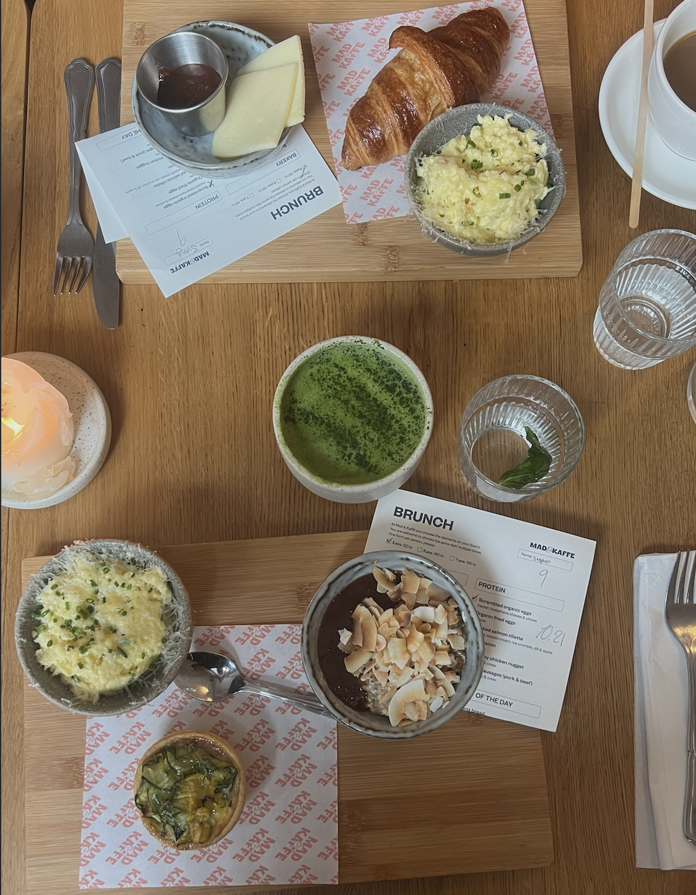

# Mad & Kaffe

Mad & Kaffe is a chain brunch restaurant located across Copenhagen, Denmark. With their name quite literally translating to Food & Coffee from Danish, they pride themselves on providing a local environment centered on a love for food and coffee while making it feel like you never left your Danish apartment.

They have four locations across the city, all providing the same menu. Their dining style resembles a "build your own breakfast" where you can choose a spread of 3, 5, of 7 items from their menu. Allowing for unlimited combinations to make the meal especially your own.

## Resteraunt and Meal

The restaurant itself was beautiful having a homely danish feel from their furniture to natural lighting. They create an atmosphere that encapsulates hygge with throw pillows and blankets at ever table.

While there I got a hot matcha, scrambled eggs, a spinach and feta quiche, and a small bowl of overnight oats.

## Image
:::: {layout-nrow=1}
{group="Mad" .lightbox width="70%" fig-align="center"}

{group="Mad" .lightbox width="70%" fig-align="center"}
::::

## Overall Review

This was an delicious and light brunch that got me ready to tackle the rest of the day. The coffee and matcha were perfectly warm for a cold day and tasted perfect. The meal itself was a perfect variety of sweet from the overnight oats and savory from the fluffy scrambled eggs and the smooth quiche.

While on the more trendy site, these places on social media are popular for a reason. The novelty of picking your own items and the beautiful curated atmosphere make this place a must stop by when in the city. I ended up taking not only my parents but my best friend when she visited.

I would give Mad & Kaffe 5 stars!

  ★★★★★

